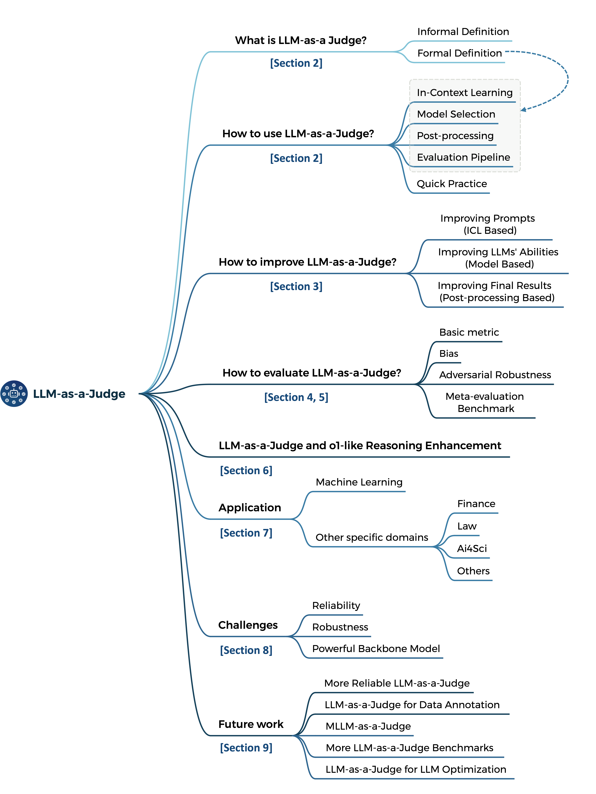
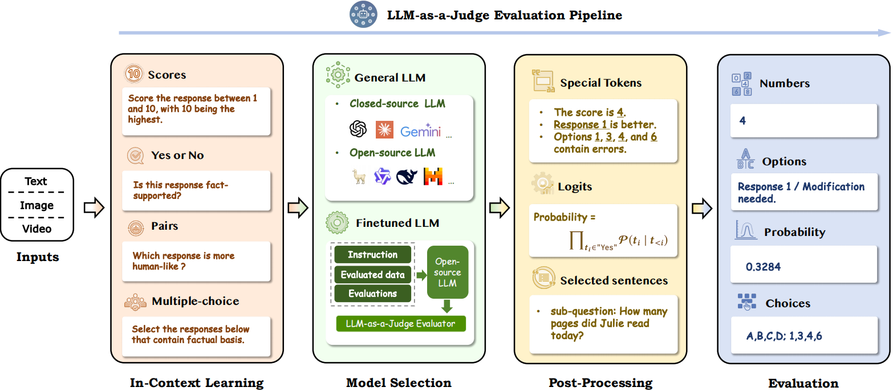
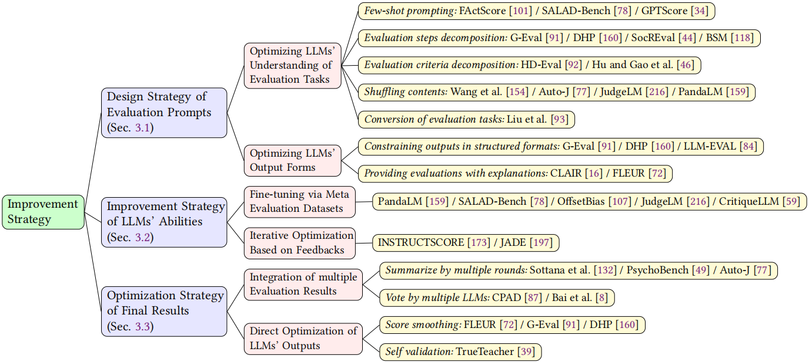

<p align="center">
     <br>
</p>
<div align="center" style="font-family: Arial, sans-serif;">
  <p>
    <a href="https://awesome-llm-as-a-judge.github.io/" style="text-decoration: none; font-weight: bold;">🌻 Homepage</a> •
    <a href="#paper-list" style="text-decoration: none; font-weight: bold;"> 📖 Paper List</a> •
    <a href="https://awesome-llm-as-a-judge.github.io/#meta-evaluation" style="text-decoration: none; font-weight: bold;">📊 Meta-eval</a> •
    <a href="https://arxiv.org/abs/2411.15594" style="text-decoration: none; font-weight: bold;">🌟 Arxiv </a> •
    <a href="https://event.baai.ac.cn/activities/878" style="text-decoration: none; font-weight: bold;"> 🔗 Talk </a>
  </p>
</div>


This repo include the papers discussed in our survey paper *[A Survey on LLM-as-a-Judge](https://arxiv.org/abs/2411.15594)*

### Reference

Feel free to cite if you find our survey is useful for your research:

```
@article{gu2024surveyllmasajudge,
	title   = {A Survey on LLM-as-a-Judge},
	author  = {Jiawei Gu and Xuhui Jiang and Zhichao Shi and Hexiang Tan and Xuehao Zhai and Chengjin Xu and Wei Li and Yinghan Shen and Shengjie Ma and Honghao Liu and Yuanzhuo Wang and Jian Guo},
	year    = {2024},
	journal = {arXiv preprint arXiv: 2411.15594}
}
```

### 🔔 News  

🔥 [2025-01-28]  We added analysis on **LLM-as-a-Judge** and **o1-like Reasoning Enhancement**, as well as [**meta-evaluation**](https://awesome-llm-as-a-judge.github.io/#meta-evaluation) results on **o1-mini**, **Gemini-2.0-Flash-Thinking-1219**, and **DeepSeek-R1**!  

🌟 [2025-01-16] We shared and discussed the **methodologies**, **applications (Finance, RAG, and Synthetic Data)**, and future research directions of **LLM-as-a-Judge** at BAAI Talk! 🤗  [[**Replay**](https://event.baai.ac.cn/activities/878)]  [[**Methodology**](https://ticket-assets.baai.ac.cn/uploads/%E6%96%B9%E6%B3%95%E8%AE%BA%E3%80%81%E5%BA%94%E7%94%A8%E4%B8%8E%E6%9C%AA%E6%9D%A5%E7%A0%94%E7%A9%B6%E6%96%B9%E5%90%91%E6%8E%A2%E8%AE%A8.pdf)]  [[**RAG & Synthetic Data**](https://ticket-assets.baai.ac.cn/uploads/LLM-as-a-Judge-%E5%BE%90%E9%93%96%E6%99%8B.pdf)]  

🚀 [2024-11-23]  We released [**A Survey on LLM-as-a-Judge**](https://arxiv.org/pdf/2411.15594), exploring **LLMs as reliable, scalable evaluators** and outlining **key challenges and future directions**!  

### Overview of LLM-as-a-Judge 




### Evaluation Pipelines




### Improvement Strategies for LLM-as-a-Judge




## Table of Content

[A Survey on LLM-as-a-Judge](#Awesome-LLM-as-a-Judge)

- [Reference](#Reference)

- [Overview of LLM-as-a-Judge](#Overview-of-LLM-as-a-Judge)

- [Evaluation Pipelines of LLM-as-a-Judge](#Evaluation-Pipelines-of-LLM-as-a-Judge)

- [Improvement Strategies for LLM-as-a-Judge](#Improvement-Strategies-for-LLM-as-a-Judge)

- [Table of Content](#Table-of-Content)

- [Paper List](#Paper-List)
  - [1 What is LLM-as-a-Judge?](#1-What-is-LLM-as-a-Judge?)
  - [2 How to use LLM-as-a-Judge?](#2-How-to-use-LLM-as-a-Judge?)
    - [2.1 In-Context Learning](#21-In-Context-Learning)
      - [Generating scores](#Generating-scores)
      - [Solving Yes/No questions](#Solving-Yes/No-questions)
      - [Conducting pairwise comparisons](#Conducting-pairwise-comparisons)
      - [Making multiple-choice selections](#Making-multiple-choice-selections)
    - [2.2 Model Selection](#22-Model-Selection)
      - [General LLM](#General-LLM)
      - [Fine-tuned LLM](#Fine-tuned-LLM)
    - [2.3 Post-processing Method](#23-Post-processing-Method)
      - [Extracting specific tokens](#Extracting-specific-tokens)
      - [Constrained decoding](#Constrained-decoding)
      - [Normalizing the output logits](#Normalizing-the-output-logits)
      - [Selecting sentences](#Selecting-sentences)
    - [2.4 Evaluation Pipeline](#24-Evaluation-Pipeline)
      - [LLM-as-a-Judge for Models](#LLM-as-a-Judge-for-Models)
      - [LLM-as-a-Judge for Data](#LLM-as-a-Judge-for-Data)
      - [LLM-as-a-Judge for Agents](#LLM-as-a-Judge-for-Agents)
      - [LLM-as-a-Judge for Reasoning/Thinking](#LLM-as-a-Judge-for-Reasoning/Thinking)
  - [3 How to improve LLM-as-a-Judge?](#3-How-to-improve-LLM-as-a-Judge?)
    - [3.1 Design Strategy of Evaluation Prompts](#31-Design-Strategy-of-Evaluation-Prompts)
      - [Few-shot promping](#Few-shot-promping)
      - [Evaluation steps decomposition](#Evaluation-steps-decomposition)
      - [Evaluation criteria decomposition](#Evaluation-criteria-decomposition)
      - [Shuffling contents](#Shuffling-contents)
      - [Conversion of evaluation tasks](#Conversion-of-evaluation-tasks)
      - [Constraining outputs in structured formats](#Constraining-outputs-in-structured-formats)
      - [Providing evaluations with explanations](#Providing-evaluations-with-explanations)
    - [3.2 Improvement Strategy of LLMs' Abilities](#32-Improvement-Strategy-of-LLMs'-Abilities)
      - [Fine-tuning via Meta Evaluation Dataset](#Fine-tuning-via-Meta-Evaluation-Dataset)
      - [Iterative Optimization Based on Feedbacks](#Iterative-Optimization-Based-on-Feedbacks)
    - [3.3 Optimization Strategy of Final Results](#33-Optimization-Strategy-of-Final-Results)
      - [Summarize by multiple rounds](#Summarize-by-multiple-rounds)
      - [Vote by multiple LLMs](#Vote-by-multiple-LLMs)
      - [Score smoothing](#Score-smoothing)
      - [Self validation](#Self-validation)
  - [4 How to evaluate LLM-as-a-Judge?](#4-How-to-evaluate-LLM-as-a-Judge?)
    - [4.1 Basic Metric](#41-Basic-Metric)
    - [4.2 Bias](#42-Basic)
      - [Position Bias](#Position-Bias)
      - [Length Bias](#Length-Bias)
      - [Self-Enhancement Bias](#Self-Enhancement-Bias)
      - [Other Bias](#Other-Bias)
    - [4.3 Adversarial Robustness](#43-Adversarial-Robustness)
  - [5 Application](#5-Application)
    - [5.1 Machine Learning](#51-Machine-Learning)
      - [Text Generation](#Text-Generation)
      - [Reasoning](#Reasoning)
      - [Retrieval](#Retrieval)
    - [5.2 Social Intelligence](#52-Social-Intelligence)
    - [5.3 Multi-Modal](#53-Multi-Modal)
    - [5.4 Other Specific Domains](#54-Other-Specific-Domains)
      - [Finance](#Finance)
      - [Law](#Law)
      - [AI for Science](#AI-for-Science)
      - [Others](#Others)
  
  - 


## Paper List

### 1 What is LLM-as-a-Judge?

### 2 How to use LLM-as-a-Judge? 

#### 2.1 In-Context Learning

##### Generating scores

- **A Multi-Aspect Framework for Counter Narrative Evaluation using Large Language Models** `NAACL` `2024`

  Jaylen Jones, Lingbo Mo, Eric Fosler-Lussier, and Huan Sun. [[Paper](https://aclanthology.org/2024.naacl-short.14)]

- **Generative judge for evaluating alignment.** `ArXiv preprint` `2023`

  Junlong Li, Shichao Sun, Weizhe Yuan, Run-Ze Fan, Hai Zhao, and Pengfei Liu. [[Paper](https://arxiv.org/abs/2310.05470)]

- **Judgelm: Fine-tuned large language models are scalable judges.** `ArXiv preprint` `2023`

  Lianghui Zhu, Xinggang Wang, and Xinlong Wang. [[Paper](https://arxiv.org/abs/2310.17631)]

- **Large Language Models are Better Reasoners with Self-Verification.** `EMNLP findings` `2023`

  Yixuan Weng, Minjun Zhu, Fei Xia, Bin Li, Shizhu He, Shengping Liu, Bin Sun, Kang Liu, and Jun Zhao. [[Paper](https://aclanthology.org/2023.findings-emnlp.167)]

- **Benchmarking Foundation Models with Language-Model-as-an-Examiner.** `NeurIPS` `2023`

  Yushi Bai, Jiahao Ying, Yixin Cao, Xin Lv, Yuze He, Xiaozhi Wang, Jifan Yu, Kaisheng Zeng, Yijia Xiao, Haozhe Lyu, Jiayin Zhang, Juanzi Li, and Lei Hou. [[Paper](https://proceedings.neurips.cc/paper_files/paper/2023/file/f64e55d03e2fe61aa4114e49cb654acb-Paper-Datasets_and_Benchmarks.html)]

- **Human-like summarization evaluation with chatgpt.** `ArXiv preprint` `2023`

  Mingqi Gao, Jie Ruan, Renliang Sun, Xunjian Yin, Shiping Yang, and Xiaojun Wan. [[Paper](https://arxiv.org/abs/2304.02554)]

##### Solving Yes/No questions

- **Reflexion: language agents with verbal reinforcement learning.** `NeurIPS` `2023`

  Noah Shinn, Federico Cassano, Ashwin Gopinath, Karthik Narasimhan, and Shunyu Yao. [[Paper](https://papers.nips.cc/paper_files/paper/2023/file/1b44b878bb782e6954cd888628510e90-Paper-Conference.html)]

- **MacGyver: Are Large Language Models Creative Problem Solvers?** `NAACL` `2024`

  Yufei Tian, Abhilasha Ravichander, Lianhui Qin, Ronan Le Bras, Raja Marjieh, Nanyun Peng, Yejin Choi, Thomas Griffiths, and Faeze Brahman. [[Paper](https://aclanthology.org/2024.naacl-long.297)]

- **Think-on-graph: Deep and responsible reasoning of large language model with knowledge graph.** `ArXiv preprint` `2023`

  Jiashuo Sun, Chengjin Xu, Lumingyuan Tang, Saizhuo Wang, Chen Lin, Yeyun Gong, Heung-Yeung Shum, and Jian Guo. [[Paper](https://arxiv.org/abs/2307.07697)]

##### Conducting pairwise comparisons

- **Large Language Models are Effective Text Rankers with Pairwise Ranking Prompting.** `NAACL findings` `2024`

  Zhen Qin, Rolf Jagerman, Kai Hui, Honglei Zhuang, Junru Wu, Le Yan, Jiaming Shen, Tianqi Liu, Jialu Liu, Donald Metzler, Xuanhui Wang, and Michael Bendersky. [[Papaer](https://aclanthology.org/2024.findings-naacl.97)]

- **Aligning with human judgement: The role of pairwise preference in large language model evaluators. ** `COLM` `2024`

  Yinhong Liu, Han Zhou, Zhijiang Guo, Ehsan Shareghi, Ivan Vulic, Anna Korhonen, and Nigel Collier. [[Paper](https://arxiv.org/abs/2403.16950)]

- **LLM Comparative Assessment: Zero-shot NLG Evaluation through Pairwise Comparisons using Large Language Models.** `EACL` `2024`

  Adian Liusie, Potsawee Manakul, and Mark Gales. [[Paper](https://aclanthology.org/2024.eacl-long.8)]

- **Judging LLM-as-a-Judge with MT-Bench and Chatbot Arena.** `NeurIPS` `2023`

  Lianmin Zheng, Wei-Lin Chiang, Ying Sheng, Siyuan Zhuang, Zhanghao Wu, Yonghao Zhuang, Zi Lin, Zhuohan Li, Dacheng Li, Eric P. Xing, Hao Zhang, Joseph E. Gonzalez, and Ion Stoica. [[Paper](https://papers.nips.cc/paper_files/paper/2023/hash/91f18a1287b398d378ef22505bf41832-Abstract-Datasets_and_Benchmarks.html)]

- **Rrhf: Rank responses to align language models with human feedback without tears.** `ArXiv preprint` `2023`

  Zheng Yuan, Hongyi Yuan, Chuanqi Tan, Wei Wang, Songfang Huang, and Fei Huang. [[Paper](https://arxiv.org/abs/2304.05302)]

- **PandaLM: An Automatic Evaluation Benchmark for LLM Instruction Tuning Optimization.** `ArXiv preprint` `2023`

  Yidong Wang, Zhuohao Yu, Zhengran Zeng, Linyi Yang, Cunxiang Wang, Hao Chen, Chaoya Jiang, Rui Xie, Jindong Wang, Xing Xie, et al. 2023. [[Paper](https://arxiv.org/abs/2306.05087)]

- **Human-like summarization evaluation with chatgpt.** `ArXiv preprint` `2023`

  Mingqi Gao, Jie Ruan, Renliang Sun, Xunjian Yin, Shiping Yang, and Xiaojun Wan. [[Paper](https://arxiv.org/abs/2304.02554)]

##### Making multiple-choice selections

- 

#### 2.2 Model Selection

##### General LLM

- **Judging LLM-as-a-Judge with MT-Bench and Chatbot Arena.** `NeurIPS` `2023`

  Lianmin Zheng, Wei-Lin Chiang, Ying Sheng, Siyuan Zhuang, Zhanghao Wu, Yonghao Zhuang, Zi Lin, Zhuohan Li, Dacheng Li, Eric P. Xing, Hao Zhang, Joseph E. Gonzalez, and Ion Stoica. [[Paper](https://papers.nips.cc/paper_files/paper/2023/hash/91f18a1287b398d378ef22505bf41832-Abstract-Datasets_and_Benchmarks.html)]

- **AlpacaEval: An Automatic Evaluator of Instruction-following Models.**  `2023`

  Xuechen Li, Tianyi Zhang, Yann Dubois, Rohan Taori, Ishaan Gulrajani, Carlos Guestrin, Percy Liang, and Tatsunori B. Hashimoto.  [[Code](https://github.com/tatsu-lab/alpaca_eval?tab=readme-ov-file)]

##### Fine-tuned LLM

- **PandaLM: An Automatic Evaluation Benchmark for LLM Instruction Tuning Optimization.** `ArXiv preprint` `2023`

  Yidong Wang, Zhuohao Yu, Zhengran Zeng, Linyi Yang, Cunxiang Wang, Hao Chen, Chaoya Jiang, Rui Xie, Jindong Wang, Xing Xie, et al. 2023. [[Paper](https://arxiv.org/abs/2306.05087)]

- **Judgelm: Fine-tuned large language models are scalable judges.** `ArXiv preprint` `2023`

  Lianghui Zhu, Xinggang Wang, and Xinlong Wang. [[Paper](https://arxiv.org/abs/2310.17631)]

- **Generative judge for evaluating alignment.** `ArXiv preprint` `2023`

  Junlong Li, Shichao Sun, Weizhe Yuan, Run-Ze Fan, Hai Zhao, and Pengfei Liu. [[Paper](https://arxiv.org/abs/2310.05470)]

- **Prometheus: Inducing Fine-grained Evaluation Capability in Language Models.** `ArXiv preprint` `2023`

  Seungone Kim, Jamin Shin, Yejin Cho, Joel Jang, Shayne Longpre, Hwaran Lee, Sangdoo Yun, Seongjin Shin, Sungdong Kim, James Thorne, et al. [[Paper](https://arxiv.org/abs/2310.08491)]

#### 2.3 Post-processing Method

##### Extracting specific tokens

- **xFinder: Robust and Pinpoint Answer Extraction for Large Language Models.** `ArXiv preprint` `2024`

  Qingchen Yu, Zifan Zheng, Shichao Song, Zhiyu Li, Feiyu Xiong, Bo Tang, and Ding Chen. [[Paper](https://arxiv.org/abs/2405.11874)]

- **MacGyver: Are Large Language Models Creative Problem Solvers?** `NAACL` `2024`

  Yufei Tian, Abhilasha Ravichander, Lianhui Qin, Ronan Le Bras, Raja Marjieh, Nanyun Peng, Yejin Choi, Thomas Griffiths, and Faeze Brahman. [[Paper](https://aclanthology.org/2024.naacl-long.297)]

##### Constrained decoding

- **Guiding LLMs the right way: fast, non-invasive constrained generation.** `ICML` `2024`

  Luca Beurer-Kellner, Marc Fischer, and Martin Vechev. [[Paper](https://dl.acm.org/doi/10.5555/3692070.3692216)]

- **XGrammar: Flexible and Efficient Structured Generation Engine for Large Language Models.** `ArXiv preprint` `2024`

  Yixin Dong, Charlie F. Ruan, Yaxing Cai, Ruihang Lai, Ziyi Xu, Yilong Zhao, and Tianqi Chen. [[Paper](https://arxiv.org/abs/2411.15100)]

- **SGLang: Efficient Execution of Structured Language Model Programs.** `NeurIPS` `2025`

  Lianmin Zheng, Liangsheng Yin, Zhiqiang Xie, Chuyue Sun, Jeff Huang, Cody Hao Yu, Shiyi Cao, Christos Kozyrakis, Ion Stoica, Joseph E. Gonzalez, Clark Barrett, and Ying Sheng. [[Paper](https://proceedings.neurips.cc/paper_files/paper/2024/hash/724be4472168f31ba1c9ac630f15dec8-Abstract-Conference.html)]

##### Normalizing the output logits

- **Reasoning with Language Model is Planning with World Model.** `EMNLP` `2023`

  Shibo Hao, Yi Gu, Haodi Ma, Joshua Hong, Zhen Wang, Daisy Wang, and Zhiting Hu. [[Paper](https://aclanthology.org/2023.emnlp-main.507)]

- **Speculative rag: Enhancing retrieval augmented generation through drafting.** `ArXiv preprint` `2024`

  Zilong Wang, Zifeng Wang, Long Le, Huaixiu Steven Zheng, Swaroop Mishra, Vincent Perot, Yuwei Zhang, Anush Mattapalli, Ankur Taly, Jingbo Shang, et al. [[Paper](https://arxiv.org/abs/2407.08223)]

- **Agent-as-a-Judge: Evaluate Agents with Agents. ** `ArXiv preprint` `2024`

  Mingchen Zhuge, Changsheng Zhao, Dylan Ashley, Wenyi Wang, Dmitrii Khizbullin, Yunyang Xiong, Zechun Liu, Ernie Chang, Raghuraman Krishnamoorthi, Yuandong Tian, et al. [[Paper](https://arxiv.org/abs/2410.10934)]

##### Selecting sentences

- **Reasoning with Language Model is Planning with World Model.** `EMNLP` `2023`

  Shibo Hao, Yi Gu, Haodi Ma, Joshua Hong, Zhen Wang, Daisy Wang, and Zhiting Hu. [[Paper](https://aclanthology.org/2023.emnlp-main.507)]

#### 2.4 Evaluation Pipeline

##### LLM-as-a-Judge for Models

- **AlpacaFarm: A Simulation Framework for Methods that Learn from Human Feedback.** `NeurIPS` `2023`

  Yann Dubois, Chen Xuechen Li, Rohan Taori, Tianyi Zhang, Ishaan Gulrajani, Jimmy Ba, Carlos Guestrin, Percy Liang, and Tatsunori B. Hashimoto. [[Paper](https://papers.nips.cc/paper_files/paper/2023/hash/5fc47800ee5b30b8777fdd30abcaaf3b-Abstract-Conference.html)]

- **Large language models are not fair evaluators.** `ACL` `2024`

  Peiyi Wang, Lei Li, Liang Chen, Dawei Zhu, Binghuai Lin, Yunbo Cao, Qi Liu, Tianyu Liu, and Zhifang Sui. [[Paper](https://aclanthology.org/2024.acl-long.511)]

- **Wider and deeper llm networks are fairer llm evaluators.** `ArXiv preprint` `2023`

  Xinghua Zhang, Bowen Yu, Haiyang Yu, Yangyu Lv, Tingwen Liu, Fei Huang, Hongbo Xu, and Yongbin Li. [[Paper](https://arxiv.org/abs/2308.01862)]

- **Judging LLM-as-a-Judge with MT-Bench and Chatbot Arena.** `NeurIPS` `2023`

  Lianmin Zheng, Wei-Lin Chiang, Ying Sheng, Siyuan Zhuang, Zhanghao Wu, Yonghao Zhuang, Zi Lin, Zhuohan Li, Dacheng Li, Eric P. Xing, Hao Zhang, Joseph E. Gonzalez, and Ion Stoica. [[Paper](https://papers.nips.cc/paper_files/paper/2023/hash/91f18a1287b398d378ef22505bf41832-Abstract-Datasets_and_Benchmarks.html)]

- **SelFee: Iterative Self-Revising LLM Empowered by Self-Feedback Generation. ** `Blog` `2023`

  Seonghyeon Ye, Yongrae Jo, Doyoung Kim, Sungdong Kim, Hyeonbin Hwang, and Minjoon Seo. [[Blog](https://kaistai.github.io/SelFee)]

- **Shepherd: A Critic for Language Model Generation.** `ArXiv preprint` `2023`

  Tianlu Wang, Ping Yu, Xiaoqing Ellen Tan, Sean O’Brien, Ramakanth Pasunuru, Jane Dwivedi-Yu, Olga Golovneva, Luke Zettlemoyer, Maryam Fazel-Zarandi, and Asli Celikyilmaz. [[Paper](https://arxiv.org/abs/2308.04592)]

- **PandaLM: An Automatic Evaluation Benchmark for LLM Instruction Tuning Optimization.** `ArXiv preprint` `2023`

  Yidong Wang, Zhuohao Yu, Zhengran Zeng, Linyi Yang, Cunxiang Wang, Hao Chen, Chaoya Jiang, Rui Xie, Jindong Wang, Xing Xie, et al. 2023. [[Paper](https://arxiv.org/abs/2306.05087)]

##### LLM-as-a-Judge for Data

- **RAFT: Reward rAnked FineTuning for Generative Foundation Model Alignment.** `ArXiv preprint` `2023`

  Hanze Dong, Wei Xiong, Deepanshu Goyal, Rui Pan, Shizhe Diao, Jipeng Zhang, Kashun Shum, and Tong Zhang. [[Paper](https://arxiv.org/abs/2304.06767)]

- **Rrhf: Rank responses to align language models with human feedback without tears.** `ArXiv preprint` `2023`

  Zheng Yuan, Hongyi Yuan, Chuanqi Tan, Wei Wang, Songfang Huang, and Fei Huang. [[Paper](https://arxiv.org/abs/2304.05302)]

- **Stanford Alpaca: An Instruction-following LLaMA model.** `2023`

  Rohan Taori, Ishaan Gulrajani, Tianyi Zhang, Yann Dubois, Xuechen Li, Carlos Guestrin, Percy Liang, and Tatsunori B. Hashimoto. [[Code](https://github.com/tatsu-lab/stanford_alpaca)]

- **Languages are rewards: Hindsight finetuning using human feedback.** `ArXiv preprint` `2023`

  Hao Liu, Carmelo Sferrazza, and Pieter Abbeel. [[Paper](https://arxiv.org/abs/2302.02676)]

- **The Wisdom of Hindsight Makes Language Models Better Instruction Followers.** `PMLR` `2023`

  Tianjun Zhang, Fangchen Liu, Justin Wong, Pieter Abbeel, and Joseph E. Gonzalez. [[Paper](https://proceedings.mlr.press/v202/zhang23ab.html)]

- **Principle-Driven Self-Alignment of Language Models from Scratch with Minimal Human Supervision. ** `NeurIPS` `2023`

  Zhiqing Sun, Yikang Shen, Qinhong Zhou, Hongxin Zhang, Zhenfang Chen, David D. Cox, Yiming Yang, and Chuang Gan. [[Paper](https://papers.nips.cc/paper_files/paper/2023/hash/0764db1151b936aca59249e2c1386101-Abstract-Conference.html)]

- **Wizardmath: Empowering mathematical reasoning for large language models via**

  **reinforced evol-instruct. ** `ArXiv preprint` `2023`

  Haipeng Luo, Qingfeng Sun, Can Xu, Pu Zhao, Jianguang Lou, Chongyang Tao, Xiubo Geng, Qingwei Lin, Shifeng Chen, and Dongmei Zhang. [[Paper](https://arxiv.org/abs/2308.09583)]

- **Self-taught evaluators.** `ArXiv preprint` `2024`

  Tianlu Wang, Ilia Kulikov, Olga Golovneva, Ping Yu, Weizhe Yuan, Jane Dwivedi-Yu, Richard Yuanzhe Pang, Maryam Fazel-Zarandi, Jason Weston, and Xian Li. [[Paper](https://arxiv.org/abs/2408.02666)]

- **Holistic analysis of hallucination in gpt-4v (ision): Bias and interference challenges.** `ArXiv preprint` `2023`

  Chenhang Cui, Yiyang Zhou, Xinyu Yang, Shirley Wu, Linjun Zhang, James Zou, and Huaxiu Yao. [[Paper](https://arxiv.org/abs/2311.03287)]

- **Evaluating Object Hallucination in Large Vision-Language Models.** `EMNLP` `2023`

  Yifan Li, Yifan Du, Kun Zhou, Jinpeng Wang, Xin Zhao, and Ji-Rong Wen. [[Paper](https://aclanthology.org/2023.emnlp-main.20/)]

- **Evaluation and analysis of hallucination in large vision-language models.** `ArXiv preprint` `2023`

  Junyang Wang, Yiyang Zhou, Guohai Xu, Pengcheng Shi, Chenlin Zhao, Haiyang Xu, Qinghao Ye, Ming Yan, Ji Zhang, Jihua Zhu, et al. [[Paper](https://arxiv.org/abs/2308.15126)]

- **Aligning large multimodal models with factually augmented rlhf.** `ArXiv preprint` `2023`

  Zhiqing Sun, Sheng Shen, Shengcao Cao, Haotian Liu, Chunyuan Li, Yikang Shen, Chuang Gan, Liang-Yan Gui, Yu-Xiong Wang, Yiming Yang, et al. [[Paper](https://arxiv.org/abs/2309.14525)]

- **MLLM-as-a-Judge: Assessing Multimodal LLM-as-a-Judge with Vision-Language Benchmark.** `ICML` `2024`

  Dongping Chen, Ruoxi Chen, Shilin Zhang, Yaochen Wang, Yinuo Liu, Huichi Zhou, Qihui Zhang, Yao Wan, Pan Zhou, and Lichao Sun. [[Paper](https://openreview.net/forum?id=dbFEFHAD79)]

##### LLM-as-a-Judge for Agents

- **Agent-as-a-Judge: Evaluate Agents with Agents. ** `ArXiv preprint` `2024`

  Mingchen Zhuge, Changsheng Zhao, Dylan Ashley, Wenyi Wang, Dmitrii Khizbullin, Yunyang Xiong, Zechun Liu, Ernie Chang, Raghuraman Krishnamoorthi, Yuandong Tian, et al. [[Paper](https://arxiv.org/abs/2410.10934)]

- **Reasoning with Language Model is Planning with World Model.** `EMNLP` `2023`

  Shibo Hao, Yi Gu, Haodi Ma, Joshua Hong, Zhen Wang, Daisy Wang, and Zhiting Hu. [[Paper](https://aclanthology.org/2023.emnlp-main.507)]

- **Reflexion: language agents with verbal reinforcement learning.** `NeurIPS` `2023`

  Noah Shinn, Federico Cassano, Ashwin Gopinath, Karthik Narasimhan, and Shunyu Yao. [[Paper](https://papers.nips.cc/paper_files/paper/2023/file/1b44b878bb782e6954cd888628510e90-Paper-Conference.pdf)]

##### LLM-as-a-Judge for Reasoning/Thinking

- **Towards Reasoning in Large Language Models: A Survey.** `ACL findings` `2023`

  Jie Huang and Kevin Chen-Chuan Chang. [[Paper](https://aclanthology.org/2023.findings-acl.67)]

- **Let’s verify step by step.** `ICLR` `2023`

  Hunter Lightman, Vineet Kosaraju, Yura Burda, Harri Edwards, Bowen Baker, Teddy Lee, Jan Leike, John Schulman, Ilya Sutskever, and Karl Cobbe. [[Paper](https://openreview.net/forum?id=v8L0pN6EOi)]

### 3 How to improve LLM-as-a-Judge?

#### 3.1 Design Strategy of Evaluation Prompts

##### Few-shot promping

- **FActScore: Fine-grained Atomic Evaluation of Factual Precision in Long Form Text Generation.** `EMNLP` `2023`

  Sewon Min, Kalpesh Krishna, Xinxi Lyu, Mike Lewis, Wen-tau Yih, Pang Koh, Mohit Iyyer, Luke Zettlemoyer, and Hannaneh Hajishirzi. [[Paper](https://aclanthology.org/2023.emnlp-main.741)]

- **SALAD-Bench: A Hierarchical and Comprehensive Safety Benchmark for Large Language Models.** `ACL findings` `2024`

  Lijun Li, Bowen Dong, Ruohui Wang, Xuhao Hu, Wangmeng Zuo, Dahua Lin, Yu Qiao, and Jing Shao. [[Paper](https://aclanthology.org/2024.findings-acl.235)]

- **GPTScore: Evaluate as You Desire.** `NAACL` `2024`

  Jinlan Fu, See-Kiong Ng, Zhengbao Jiang, and Pengfei Liu. [[Paper](https://aclanthology.org/2024.naacl-long.365)]

##### Evaluation steps decomposition

- **G-Eval: NLG Evaluation using Gpt-4 with Better Human Alignment.** `EMNLP` `2023`

  Yang Liu, Dan Iter, Yichong Xu, Shuohang Wang, Ruochen Xu, and Chenguang Zhu. [[Paper](https://aclanthology.org/2023.emnlp-main.153)]

- **DHP Benchmark: Are LLMs Good NLG Evaluators?** `ArXiv preprint` `2024`

  Yicheng Wang, Jiayi Yuan, Yu-Neng Chuang, Zhuoer Wang, Yingchi Liu, Mark Cusick, Param Kulkarni, Zhengping Ji, Yasser Ibrahim, and Xia Hu. [[Paper](https://arxiv.org/abs/2408.13704)]

- **SocREval: Large Language Models with the Socratic Method for Reference-free Reasoning Evaluation.** `NAACL findings` `2024`

  Hangfeng He, Hongming Zhang, and Dan Roth. [[Paper](https://aclanthology.org/2024.findings-naacl.175)]

- **Branch-Solve-Merge Improves Large Language Model Evaluation and Generation.** `NAACL` `2024`

  Swarnadeep Saha, Omer Levy, Asli Celikyilmaz, Mohit Bansal, Jason Weston, and Xian Li. [[Paper](https://aclanthology.org/2024.naacl-long.462)]

##### Evaluation criteria decomposition

- **HD-Eval: Aligning Large Language Model Evaluators Through Hierarchical Criteria Decomposition.** `ACL` `2024`

  Yuxuan Liu, Tianchi Yang, Shaohan Huang, Zihan Zhang, Haizhen Huang, Furu Wei, Weiwei Deng, Feng Sun, and Qi Zhang. [[Paper](https://aclanthology.org/2024.acl-long.413)]

- **Are LLM-based Evaluators Confusing NLG Quality Criteria?** `ACL` `2024`

  Xinyu Hu, Mingqi Gao, Sen Hu, Yang Zhang, Yicheng Chen, Teng Xu, and Xiaojun Wan. [[Paper](https://aclanthology.org/2024.acl-long.516)]

##### Shuffling contents

- **Large language models are not fair evaluators.** `ACL` `2024`

  Peiyi Wang, Lei Li, Liang Chen, Dawei Zhu, Binghuai Lin, Yunbo Cao, Qi Liu, Tianyu Liu, and Zhifang Sui. [[Paper](https://aclanthology.org/2024.acl-long.511)]

- **Generative judge for evaluating alignment.** `ArXiv preprint` `2023`

  Junlong Li, Shichao Sun, Weizhe Yuan, Run-Ze Fan, Hai Zhao, and Pengfei Liu. [[Paper](https://arxiv.org/abs/2310.05470)]

- **Judgelm: Fine-tuned large language models are scalable judges.** `ArXiv preprint` `2023`

  Lianghui Zhu, Xinggang Wang, and Xinlong Wang. [[Paper](https://arxiv.org/abs/2310.17631)]

- **PandaLM: An Automatic Evaluation Benchmark for LLM Instruction Tuning Optimization.** `ArXiv preprint` `2023`

  Yidong Wang, Zhuohao Yu, Zhengran Zeng, Linyi Yang, Cunxiang Wang, Hao Chen, Chaoya Jiang, Rui Xie, Jindong Wang, Xing Xie, et al. 2023. [[Paper](https://arxiv.org/abs/2306.05087)]

##### Conversion of evaluation tasks

- **Aligning with human judgement: The role of pairwise preference in large language model evaluators. ** `COLM` `2024`

  Yinhong Liu, Han Zhou, Zhijiang Guo, Ehsan Shareghi, Ivan Vulic, Anna Korhonen, and Nigel Collier. [[Paper](https://arxiv.org/abs/2403.16950)]

##### Constraining outputs in structured formats

- **G-Eval: NLG Evaluation using Gpt-4 with Better Human Alignment.** `EMNLP` `2023`

  Yang Liu, Dan Iter, Yichong Xu, Shuohang Wang, Ruochen Xu, and Chenguang Zhu. [[Paper](https://aclanthology.org/2023.emnlp-main.153)]

- **DHP Benchmark: Are LLMs Good NLG Evaluators?** `ArXiv preprint` `2024`

  Yicheng Wang, Jiayi Yuan, Yu-Neng Chuang, Zhuoer Wang, Yingchi Liu, Mark Cusick, Param Kulkarni, Zhengping Ji, Yasser Ibrahim, and Xia Hu. [[Paper](https://arxiv.org/abs/2408.13704)]

- **LLM-Eval: Unified Multi-Dimensional Automatic Evaluation for Open-Domain Conversations with Large Language Models.** `NLP4ConvAI` `2023`

  Yen-Ting Lin and Yun-Nung Chen. [[Paper](https://aclanthology.org/2023.nlp4convai-1.5)]

##### Providing evaluations with explanations

- **CLAIR: Evaluating Image Captions with Large Language Models.** `EMNLP` `2023`

  David Chan, Suzanne Petryk, Joseph Gonzalez, Trevor Darrell, and John Canny. [[Paper](https://aclanthology.org/2023.emnlp-main.841)]

- **FLEUR: An Explainable Reference-Free Evaluation Metric for Image Captioning Using a Large Multimodal Model.** `ACL` `2024`

  Yebin Lee, Imseong Park, and Myungjoo Kang. [[Paper](https://aclanthology.org/2024.acl-long.205)]

#### 3.2 Improvement Strategy of LLMs' Abilities

##### Fine-tuning via Meta Evaluation Dataset

- **PandaLM: An Automatic Evaluation Benchmark for LLM Instruction Tuning Optimization.** `ArXiv preprint` `2023`

  Yidong Wang, Zhuohao Yu, Zhengran Zeng, Linyi Yang, Cunxiang Wang, Hao Chen, Chaoya Jiang, Rui Xie, Jindong Wang, Xing Xie, et al. 2023. [[Paper](https://arxiv.org/abs/2306.05087)]

- **SALAD-Bench: A Hierarchical and Comprehensive Safety Benchmark for Large Language Models.** `ACL findings` `2024`

  Lijun Li, Bowen Dong, Ruohui Wang, Xuhao Hu, Wangmeng Zuo, Dahua Lin, Yu Qiao, and Jing Shao. [[Paper](https://aclanthology.org/2024.findings-acl.235)]

- **Offsetbias: Leveraging debiased data for tuning evaluators.** `ArXiv preprint` `2024`

  Junsoo Park, Seungyeon Jwa, Meiying Ren, Daeyoung Kim, and Sanghyuk Choi. [[Papaer](https://arxiv.org/abs/2407.06551)]

- **Judgelm: Fine-tuned large language models are scalable judges.** `ArXiv preprint` `2023`

  Lianghui Zhu, Xinggang Wang, and Xinlong Wang. [[Paper](https://arxiv.org/abs/2310.17631)]

- **CritiqueLLM: Towards an Informative Critique Generation Model for Evaluation of Large Language Model Generation.** `ACL` `2024`

  Pei Ke, Bosi Wen, Andrew Feng, Xiao Liu, Xuanyu Lei, Jiale Cheng, Shengyuan Wang, Aohan Zeng, Yuxiao Dong, Hongning Wang, et al. [[Paper](https://aclanthology.org/2024.acl-long.704)]

##### Iterative Optimization Based on Feedbacks

- **INSTRUCTSCORE: Towards Explainable Text Generation Evaluation with Automatic Feedback.** `EMNLP` `2023`

  Wenda Xu, Danqing Wang, Liangming Pan, Zhenqiao Song, Markus Freitag, William Wang, and Lei Li. [[Paper](https://aclanthology.org/2023.emnlp-main.365)]

- **Jade: A linguistics-based safety evaluation platform for llm.** `ArXiv preprint` `2023`

  Mi Zhang, Xudong Pan, and Min Yang. [[Paper](https://arxiv.org/abs/2311.00286)]

#### 3.3 Optimization Strategy of Final Results

##### Summarize by multiple rounds

- **Evaluation Metrics in the Era of GPT-4: Reliably Evaluating Large Language Models on Sequence to Sequence Tasks.** `EMNLP` `2023`

  Andrea Sottana, Bin Liang, Kai Zou, and Zheng Yuan. [[Paper](https://aclanthology.org/2023.emnlp-main.543)]

- **On the humanity of conversational ai: Evaluating the psychological portrayal of llms.** `ICLR` `2023`

  Jen-tse Huang, Wenxuan Wang, Eric John Li, Man Ho Lam, Shujie Ren, Youliang Yuan, Wenxiang Jiao, Zhaopeng Tu, and Michael Lyu. [[Paper](https://openreview.net/forum?id=H3UayAQWoE)]

- **Generative judge for evaluating alignment.** `ArXiv preprint` `2023`

  Junlong Li, Shichao Sun, Weizhe Yuan, Run-Ze Fan, Hai Zhao, and Pengfei Liu. [[Paper](https://arxiv.org/abs/2310.05470)]

##### Vote by multiple LLMs

- **Goal-Oriented Prompt Attack and Safety Evaluation for LLMs.** `ArXiv preprint` `2023`

  Chengyuan Liu, Fubang Zhao, Lizhi Qing, Yangyang Kang, Changlong Sun, Kun Kuang, and Fei Wu. [[Paper](https://arxiv.org/abs/2309.11830)]

- **Benchmarking Foundation Models with Language-Model-as-an-Examiner.** `NeurIPS` `2023`

  Yushi Bai, Jiahao Ying, Yixin Cao, Xin Lv, Yuze He, Xiaozhi Wang, Jifan Yu, Kaisheng Zeng, Yijia Xiao, Haozhe Lyu, Jiayin Zhang, Juanzi Li, and Lei Hou. [[Paper](https://proceedings.neurips.cc/paper_files/paper/2023/file/f64e55d03e2fe61aa4114e49cb654acb-Paper-Datasets_and_Benchmarks.pdf)]

##### Score smoothing

- **FLEUR: An Explainable Reference-Free Evaluation Metric for Image Captioning Using a Large Multimodal Model.** `ACL` `2024`

  Yebin Lee, Imseong Park, and Myungjoo Kang. [[Paper](https://aclanthology.org/2024.acl-long.205)]

- **G-Eval: NLG Evaluation using Gpt-4 with Better Human Alignment.** `EMNLP` `2023`

  Yang Liu, Dan Iter, Yichong Xu, Shuohang Wang, Ruochen Xu, and Chenguang Zhu. [[Paper](https://aclanthology.org/2023.emnlp-main.153)]

- **DHP Benchmark: Are LLMs Good NLG Evaluators?** `ArXiv preprint` `2024`

  Yicheng Wang, Jiayi Yuan, Yu-Neng Chuang, Zhuoer Wang, Yingchi Liu, Mark Cusick, Param Kulkarni, Zhengping Ji, Yasser Ibrahim, and Xia Hu. [[Paper](https://arxiv.org/abs/2408.13704)]

##### Self validation

- **TrueTeacher: Learning Factual Consistency Evaluation with Large Language Models.** `EMNLP` `2023`

  Zorik Gekhman, Jonathan Herzig, Roee Aharoni, Chen Elkind, and Idan Szpektor. [[Paper](https://aclanthology.org/2023.emnlp-main.127)]

### 4 How to evaluate LLM-as-a-Judge？

#### 4.1 Basic Metric

- **Judging the Judges: Evaluating Alignment and Vulnerabilities in LLMs-as-Judges.** `ArXiv preprint` `2024`

  Aman Singh Thakur, Kartik Choudhary, Venkat Srinik Ramayapally, Sankaran Vaidyanathan, and Dieuwke Hupkes. [[Paper](https://arxiv.org/abs/2406.12624)]

- **Benchmarking Foundation Models with Language-Model-as-an-Examiner.** `NeurIPS` `2023`

  Yushi Bai, Jiahao Ying, Yixin Cao, Xin Lv, Yuze He, Xiaozhi Wang, Jifan Yu, Kaisheng Zeng, Yijia Xiao, Haozhe Lyu, Jiayin Zhang, Juanzi Li, and Lei Hou. [[Paper](https://proceedings.neurips.cc/paper_files/paper/2023/file/f64e55d03e2fe61aa4114e49cb654acb-Paper-Datasets_and_Benchmarks.pdf)]

- **Aligning with human judgement: The role of pairwise preference in large language model evaluators. ** `COLM` `2024`

  Yinhong Liu, Han Zhou, Zhijiang Guo, Ehsan Shareghi, Ivan Vulic, Anna Korhonen, and Nigel Collier. [[Paper](https://arxiv.org/abs/2403.16950)]

- *MTBench & Chatbot Arena Conversations*：**Judging LLM-as-a-Judge with MT-Bench and Chatbot Arena.** `NeurIPS` `2023`

  Lianmin Zheng, Wei-Lin Chiang, Ying Sheng, Siyuan Zhuang, Zhanghao Wu, Yonghao Zhuang, Zi Lin, Zhuohan Li, Dacheng Li, Eric P. Xing, Hao Zhang, Joseph E. Gonzalez, and Ion Stoica. [[Paper](https://papers.nips.cc/paper_files/paper/2023/hash/91f18a1287b398d378ef22505bf41832-Abstract-Datasets_and_Benchmarks.html)]

- *FairEval*：**Large language models are not fair evaluators.** `ACL` `2024`

  Peiyi Wang, Lei Li, Liang Chen, Dawei Zhu, Binghuai Lin, Yunbo Cao, Qi Liu, Tianyu Liu, and Zhifang Sui. [[Paper](https://aclanthology.org/2024.acl-long.511)]

- *LLMBar*：**Evaluating Large Language Models at Evaluating Instruction Following.** `ArXiv preprint` `2023`

  Zhiyuan Zeng, Jiatong Yu, Tianyu Gao, Yu Meng, Tanya Goyal, and Danqi Chen. [[Paper](https://arxiv.org/abs/2310.07641)]

- **MLLM-as-a-Judge: Assessing Multimodal LLM-as-a-Judge with Vision-Language Benchmark.** `ICML` `2024`

  Dongping Chen, Ruoxi Chen, Shilin Zhang, Yaochen Wang, Yinuo Liu, Huichi Zhou, Qihui Zhang, Yao Wan, Pan Zhou, and Lichao Sun. [[Paper](https://openreview.net/forum?id=dbFEFHAD79)]

- **CodeJudge-Eval: Can Large Language Models be Good Judges in Code Understanding?** `COLING` `2025`

  Yuwei Zhao, Ziyang Luo, Yuchen Tian, Hongzhan Lin, Weixiang Yan, Annan Li, and Jing Ma. [[Paper](https://aclanthology.org/2025.coling-main.7)]

- *KUDGE*：**LLM-as-a-Judge & Reward Model: What They Can and Cannot Do.** `ArXiv preprint` `2024`

  Guijin Son, Hyunwoo Ko, Hoyoung Lee, Yewon Kim, and Seunghyeok Hong. [[Paper](https://arxiv.org/abs/2409.11239)]

- *CALM*：**Justice or Prejudice? Quantifying Biases in LLM-as-a-Judge.** `ArXiv preprint` `2024`

  Jiayi Ye, Yanbo Wang, Yue Huang, Dongping Chen, Qihui Zhang, Nuno Moniz, Tian Gao, Werner Geyer, Chao Huang, Pin-Yu Chen, et al. [[Paper](https://arxiv.org/abs/2410.02736)]

- *LLMEval*$^2$：**Wider and deeper llm networks are fairer llm evaluators.** `ArXiv preprint` `2023`

  Xinghua Zhang, Bowen Yu, Haiyang Yu, Yangyu Lv, Tingwen Liu, Fei Huang, Hongbo Xu, and Yongbin Li. [[Paper](https://arxiv.org/abs/2308.01862)]

#### 4.2 Bias

##### Position Bias

- **Judging the Judges: A Systematic Investigation of Position Bias in Pairwise Comparative Assessments by LLMs.** `ArXiv preprint` `2024`

  Lin Shi, Weicheng Ma, and Soroush Vosoughi. [[Paper](https://arxiv.org/abs/2406.07791)]

- **Large language models are not fair evaluators.** `ACL` `2024`

  Peiyi Wang, Lei Li, Liang Chen, Dawei Zhu, Binghuai Lin, Yunbo Cao, Qi Liu, Tianyu Liu, and Zhifang Sui. [[Paper](https://aclanthology.org/2024.acl-long.511)]

- **Justice or Prejudice? Quantifying Biases in LLM-as-a-Judge.** `ArXiv preprint` `2024`

  Jiayi Ye, Yanbo Wang, Yue Huang, Dongping Chen, Qihui Zhang, Nuno Moniz, Tian Gao, Werner Geyer, Chao Huang, Pin-Yu Chen, et al. [[Paper](https://arxiv.org/abs/2410.02736)]

##### Length Bias

- **An Empirical Study of LLM-as-a-Judge for LLM Evaluation: Fine-tuned Judge Model is not a General Substitute for GPT-4** `ArXiv preprint` `2024`

  Hui Huang, Yingqi Qu, Xingyuan Bu, Hongli Zhou, Jing Liu, Muyun Yang, Bing Xu, Tiejun Zhao. [[Paper](https://arxiv.org/abs/2403.02839)]

- **Offsetbias: Leveraging debiased data for tuning evaluators.** `ArXiv preprint` `2024`

  Junsoo Park, Seungyeon Jwa, Meiying Ren, Daeyoung Kim, and Sanghyuk Choi. [[Papaer](https://arxiv.org/abs/2407.06551)]

- **Verbosity Bias in Preference Labeling by Large Language Models.** `ArXiv preprint` `2023`

  Keita Saito, Akifumi Wachi, Koki Wataoka, and Youhei Akimoto. [[Paper](https://arxiv.org/abs/2310.10076)]

##### Self-Enhancement Bias

- **Justice or Prejudice? Quantifying Biases in LLM-as-a-Judge.** `ArXiv preprint` `2024`

  Jiayi Ye, Yanbo Wang, Yue Huang, Dongping Chen, Qihui Zhang, Nuno Moniz, Tian Gao, Werner Geyer, Chao Huang, Pin-Yu Chen, et al. [[Paper](https://arxiv.org/abs/2410.02736)]

- **Judging LLM-as-a-Judge with MT-Bench and Chatbot Arena.** `NeurIPS` `2023`

  Lianmin Zheng, Wei-Lin Chiang, Ying Sheng, Siyuan Zhuang, Zhanghao Wu, Yonghao Zhuang, Zi Lin, Zhuohan Li, Dacheng Li, Eric P. Xing, Hao Zhang, Joseph E. Gonzalez, and Ion Stoica. [[Paper](https://papers.nips.cc/paper_files/paper/2023/hash/91f18a1287b398d378ef22505bf41832-Abstract-Datasets_and_Benchmarks.html)]

##### Other Bias

- **Humans or LLMs as the Judge? A Study on Judgement Bias.** `EMNLP` `2024`

  Guiming Hardy Chen, Shunian Chen, Ziche Liu, Feng Jiang, Benyou Wang. [[Paper](https://aclanthology.org/2024.emnlp-main.474)]

- **Subtle Biases Need Subtler Measures: Dual Metrics for Evaluating Representative and Affinity Bias in Large Language Models. ** `ACL` `2024`

  Abhishek Kumar, Sarfaroz Yunusov, Ali Emami. [[Paper](https://aclanthology.org/2024.acl-long.23/)]

- **Examining Query Sentiment Bias Effects on Search Results in Large Language Models.** `ESSIR` `2023`

  Alice Li, and Luanne Sinnamon. [[Paper](https://2023.essir.eu/FDIA/papers/FDIA_2023_paper_2.pdf)]

#### 4.3 Adversarial Robustness

- **Is LLM-as-a-Judge Robust? Investigating Universal Adversarial Attacks on Zero-shot LLM Assessment.** `EMNLP` `2024`

  Vyas Raina, Adian Liusie, Mark Gales. [[Paper](https://aclanthology.org/2024.emnlp-main.427)]

- **Are LLM-Judges Robust to Expressions of Uncertainty? Investigating the effect of Epistemic Markers on LLM-based Evaluation.** `ArXiv preprint` `2024`

  Dongryeol Lee, Yerin Hwang, Yongil Kim, Joonsuk Park, and Kyomin Jung. [[Paper](https://arxiv.org/abs/2410.20774)]

- **Cheating Automatic LLM Benchmarks: Null Models Achieve High Win Rates.** `ICLR` `2025`

  Xiaosen Zheng, Tianyu Pang, Chao Du, Qian Liu, Jing Jiang, and Min Lin. [[Paper](https://arxiv.org/abs/2410.07137)] 

- **Benchmarking Cognitive Biases in Large Language Models as Evaluators.** `ACL Findings` `2024`

  Ryan Koo, Minhwa Lee, Vipul Raheja, Jong Inn Park, Zae Myung Kim, and Dongyeop Kang. [[Paper](https://aclanthology.org/2024.findings-acl.29)]

- **Baseline Defenses for Adversarial Attacks Against Aligned Language Models.** `ArXiv preprint` `2023`

  Neel Jain, Avi Schwarzschild, Yuxin Wen, Gowthami Somepalli, John Kirchenbauer, Ping-yeh Chiang, Micah Goldblum, Aniruddha Saha, Jonas Geiping, and Tom Goldstein. [[Paper](https://arxiv.org/abs/2309.00614)]

### 5 Application

#### 5.1 Machine Learning

##### Text Generation

- **Reference-Guided Verdict: LLMs-as-Judges in Automatic Evaluation of Free-Form Text.** `ArXiv preprint` `2024`

  Sher Badshah, and Hassan Sajjad. [[Paper](https://arxiv.org/abs/2408.09235)]

- **Enhancing Annotated Bibliography Generation with LLM Ensembles.** `ArXiv preprint` `2024`

  Sergio Bermejo. [[Paper](https://arxiv.org/abs/2412.20864)]

- **Human-like summarization evaluation with chatgpt.** `ArXiv preprint` `2023`

  Mingqi Gao, Jie Ruan, Renliang Sun, Xunjian Yin, Shiping Yang, and Xiaojun Wan. [[Paper](https://arxiv.org/abs/2304.02554)]

- **Large Language Models are Diverse Role-Players for Summarization Evaluation.** `NLPCC` `2023`

  Ning Wu, Ming Gong, Linjun Shou, Shining Liang, and Daxin Jiang. [[Paper](https://link.springer.com/chapter/10.1007/978-3-031-44693-1_54)]

- **Evaluating Hallucinations in Chinese Large Language Models.** `ArXiv preprint` `2023`

  Qinyuan Cheng, Tianxiang Sun, Wenwei Zhang, Siyin Wang, Xiangyang Liu, Mozhi Zhang, Junliang He, Mianqiu Huang, Zhangyue Yin, Kai Chen, et al. [[Paper](https://arxiv.org/abs/2310.03368)]

- **Balancing Speciality and Versatility: a Coarse to Fine Framework for Supervised Fine-tuning Large Language Model.** `ACL findings` `2024`

  Hengyuan Zhang, Yanru Wu, Dawei Li, Sak Yang, Rui Zhao, Yong Jiang, and Fei Tan. [[Paper](https://aclanthology.org/2024.findings-acl.445)]

- **Halu-J: Critique-Based Hallucination Judge.** `ArXiv preprint` `2024`

  Binjie Wang, Steffi Chern, Ethan Chern, and Pengfei Liu. [[Paper](https://arxiv.org/abs/2407.12943)]

- *MD-Judge & MCQ-Judge*：**SALAD-Bench: A Hierarchical and Comprehensive Safety Benchmark for Large Language Models.** `ACL findings` `2024`

  Lijun Li, Bowen Dong, Ruohui Wang, Xuhao Hu, Wangmeng Zuo, Dahua Lin, Yu Qiao, and Jing Shao. [[Paper](https://aclanthology.org/2024.findings-acl.235)]

- **SORRY-Bench: Systematically Evaluating Large Language Model Safety Refusal.** `ArXiv preprint` `2024`

  Tinghao Xie, Xiangyu Qi, Yi Zeng, Yangsibo Huang, Udari Madhushani Sehwag, Kaixuan Huang, Luxi He, Boyi Wei, Dacheng Li, Ying Sheng, et al. [[Paper](https://arxiv.org/abs/2406.14598)]

- **L-eval: Instituting standardized evaluation for long context language models.** `ACL` `2024`

  Chenxin An, Shansan Gong, Ming Zhong, Xingjian Zhao, Mukai Li, Jun Zhang, Lingpeng Kong, and Xipeng Qiu. [[Paper](https://aclanthology.org/2024.acl-long.776/)]

- **LongBench v2: Towards Deeper Understanding and Reasoning on Realistic Long-context Multitasks.** `ArXiv preprint` `2024`

  Yushi Bai, Shangqing Tu, Jiajie Zhang, Hao Peng, Xiaozhi Wang, Xin Lv, Shulin Cao, Jiazheng Xu, Lei Hou, Yuxiao Dong, et al. 2024. [[Paper](https://arxiv.org/abs/2412.15204)]

- **ChatEval: Towards Better LLM-based Evaluators through Multi-Agent Debate.** `ICLR` `2024`

  Chi-Min Chan, Weize Chen, Yusheng Su, Jianxuan Yu, Wei Xue, Shanghang Zhang, Jie Fu, and Zhiyuan Liu. [[Paper](https://arxiv.org/abs/2308.07201)]

##### Reasoning

- **StrategyLLM: Large Language Models as Strategy Generators, Executors, Optimizers, and Evaluators for Problem Solving.** `NeurIPS` `2024`

  Chang Gao, Haiyun Jiang, Deng Cai, Shuming Shi, and Wai Lam. [[Paper](https://proceedings.neurips.cc/paper_files/paper/2024/hash/af7cc9e2366b8f8837a6ef339810277a-Abstract-Conference.html)]

- **Rationale-Aware Answer Verification by Pairwise Self-Evaluation.** `EMNLP` `2024`

  Akira Kawabata and Saku Sugawara. [[Paper](https://aclanthology.org/2024.emnlp-main.905)]

- **Improving Diversity of Demographic Representation in Large Language Models via Collective-Critiques and Self-Voting.** `EMNLP` `2023`

  Preethi Lahoti, Nicholas Blumm, Xiao Ma, Raghavendra Kotikalapudi, Sahitya Potluri, Qijun Tan, Hansa Srinivasan, Ben Packer, Ahmad Beirami, Alex Beutel, and Jilin Chen. [[Paper](https://aclanthology.org/2023.emnlp-main.643)]

- **Encouraging Divergent Thinking in Large Language Models through Multi-Agent Debate.** `EMNLP` `2024`

  Tian Liang, Zhiwei He, Wenxiang Jiao, Xing Wang, Yan Wang, Rui Wang, Yujiu Yang, Zhaopeng Tu, and Shuming Shi. [[Paper](https://aclanthology.org/2024.emnlp-main.992)]

- **SMoA: Improving Multi-agent Large Language Models with Sparse Mixture-of-Agents.** `ArXiv preprint` `2024`

  Dawei Li, Zhen Tan, Peijia Qian, Yifan Li, Kumar Satvik Chaudhary, Lijie Hu, and Jiayi Shen. [[Paper](https://arxiv.org/abs/2411.03284)]

- **Selection-Inference: Exploiting Large Language Models for Interpretable Logical Reasoning.** `ICLR` `2023`

  Antonia Creswell, Murray Shanahan, and Irina Higgins. [[Paper](https://openreview.net/forum?id=3Pf3Wg6o-A4)]

- **Improving Model Factuality with Fine-grained Critique-based Evaluator.** `ArXiv preprint` `2024`

  Yiqing Xie, Wenxuan Zhou, Pradyot Prakash, Di Jin, Yuning Mao, Quintin Fettes, Arya Talebzadeh, Sinong Wang, Han Fang, Carolyn Rose, et al. [[Paper](https://arxiv.org/abs/2410.18359)]

- **Let’s verify step by step.** `ICLR` `2023`

  Hunter Lightman, Vineet Kosaraju, Yura Burda, Harri Edwards, Bowen Baker, Teddy Lee, Jan Leike, John Schulman, Ilya Sutskever, and Karl Cobbe. [[Paper](https://openreview.net/forum?id=v8L0pN6EOi)]

- **Rewarding Progress: Scaling Automated Process Verifiers for LLM Reasoning.** `ArXiv preprint` `2024`

  Amrith Setlur, Chirag Nagpal, Adam Fisch, Xinyang Geng, Jacob Eisenstein, Rishabh Agarwal, Alekh Agarwal, Jonathan Berant, and Aviral Kumar. [[Paper](https://arxiv.org/abs/2410.08146)]

- **Reasoning with Language Model is Planning with World Model.** `EMNLP` `2023`

  Shibo Hao, Yi Gu, Haodi Ma, Joshua Hong, Zhen Wang, Daisy Wang, and Zhiting Hu. [[Paper](https://aclanthology.org/2023.emnlp-main.507)]

- **Graph of Thoughts: Solving Elaborate Problems with Large Language Models.** `AAAI` `2024`

  Maciej Besta, Nils Blach, Ales Kubicek, Robert Gerstenberger, Michal Podstawski, Lukas Gianinazzi, Joanna Gajda, Tomasz Lehmann, Hubert Niewiadomski, Piotr Nyczyk, and Torsten Hoefler. [[Paper](https://ojs.aaai.org/index.php/AAAI/article/view/29720)]

- **Critique-out-loud reward models.** `ArXiv preprint` `2024`

  Zachary Ankner, Mansheej Paul, Brandon Cui, Jonathan D Chang, and Prithviraj Ammanabrolu. [[Paper](https://arxiv.org/abs/2408.11791)]

- **CriticEval: Evaluating Large-scale Language Model as Critic.** `NeurIPS` `2024`

  Tian Lan, Wenwei Zhang, Chen Xu, Heyan Huang, Dahua Lin, Kai Chen, and Xian-Ling Mao. [[Paper](https://proceedings.neurips.cc/paper_files/paper/2024/hash/7b7d7985f62284060d65f532ed2ea5fa-Abstract-Conference.html)]

- **MCQG-SRefine: Multiple Choice Question Generation and Evaluation with Iterative Self-Critique, Correction, and Comparison Feedback.** `ArXiv preprint` `2024`

  Zonghai Yao, Aditya Parashar, Huixue Zhou, Won Seok Jang, Feiyun Ouyang, Zhichao Yang, and Hong Yu. [[Paper](https://arxiv.org/abs/2410.13191)]

- **A Multi-AI Agent System for Autonomous Optimization of Agentic AI Solutions via Iterative Refinement and LLM-Driven Feedback Loops.** `ArXiv preprint` `2024`

  Kamer Ali Yuksel, and Hassan Sawaf. [[Paper](https://arxiv.org/abs/2412.17149)]

- **ReAct: Synergizing Reasoning and Acting in Language Models.** `ICLR` `2023`

  Shunyu Yao, Jeffrey Zhao, Dian Yu, Nan Du, Izhak Shafran, Karthik R. Narasimhan, and Yuan Cao. [[Paper](https://openreview.net/forum?id=WE_vluYUL-X)]

- **Auto-GPT for Online Decision Making: Benchmarks and Additional Opinions.** `ArXiv preprint` `2023`

  Hui Yang, Sifu Yue, and Yunzhong He. [[Paper](https://arxiv.org/abs/2306.02224)]

- **LanguageMPC: Large Language Models as Decision Makers for Autonomous Driving.** `ArXiv preprint` `2023`

  Hao Sha, Yao Mu, Yuxuan Jiang, Li Chen, Chenfeng Xu, Ping Luo, Shengbo Eben Li, Masayoshi Tomizuka, Wei Zhan, and Mingyu Ding. [[Paper](https://arxiv.org/abs/2310.03026)]

- **SELF-DISCOVER: Large Language Models Self-Compose Reasoning Structures.** `NeurIPS` `2024`

  Pei Zhou, Jay Pujara, Xiang Ren, Xinyun Chen, Heng-Tze Cheng, Quoc V Le, Ed H Chi, Denny Zhou, Swaroop Mishra, and Huaixiu Steven Zheng. [[Paper](https://proceedings.neurips.cc/paper_files/paper/2024/hash/e41efb03e20ca3c231940a3c6917ef6f-Abstract-Conference.html)]

##### Retrieval

- **Beyond Yes and No: Improving Zero-Shot LLM Rankers via Scoring Fine-Grained Relevance Labels.** `NAACL` `2024`

  Honglei Zhuang, Zhen Qin, Kai Hui, Junru Wu, Le Yan, Xuanhui Wang, and Michael Bendersky. [[Paper](https://aclanthology.org/2024.naacl-short.31)]

- **Zero-Shot Listwise Document Reranking with a Large Language Model.** `ArXiv preprint` `2023`

  Xueguang Ma, Xinyu Zhang, Ronak Pradeep, and Jimmy Lin. [[Paper](https://arxiv.org/abs/2305.02156)]

- **A Setwise Approach for Effective and Highly Efficient Zero-shot Ranking with Large Language Models.** `SIGIR` `2024`

  Shengyao Zhuang, Honglei Zhuang, Bevan Koopman, and Guido Zuccon. [[Paper](https://dl.acm.org/doi/abs/10.1145/3626772.3657813)]

- **Found in the Middle: Permutation Self-Consistency Improves Listwise Ranking in Large Language Models.** `NAACL` `2024`

  Raphael Tang, Crystina Zhang, Xueguang Ma, Jimmy Lin, and Ferhan Ture. [[Paper](https://aclanthology.org/2024.naacl-long.129)]

- **Large Language Models are Effective Text Rankers with Pairwise Ranking Prompting.** `NAACL findings` `2024`

  Zhen Qin, Rolf Jagerman, Kai Hui, Honglei Zhuang, Junru Wu, Le Yan, Jiaming Shen, Tianqi Liu, Jialu Liu, Donald Metzler, Xuanhui Wang, and Michael Bendersky. [[Papaer](https://aclanthology.org/2024.findings-naacl.97)]

- **Self-Retrieval: Building an Information Retrieval System with One Large Language Model.** `ArXiv preprint` `2024`

  Qiaoyu Tang, Jiawei Chen, Bowen Yu, Yaojie Lu, Cheng Fu, Haiyang Yu, Hongyu Lin, Fei Huang, Ben He, Xianpei Han, et al. [[Paper](https://arxiv.org/abs/2403.00801)]

- **Evaluating RAG-Fusion with RAGElo: an Automated Elo-based Framework.** `LLM4Eval @ SIGIR` `2024`

  Zackary Rackauckas, Arthur Câmara, and Jakub Zavrel. [[Paper](https://arxiv.org/abs/2406.14783)]

- **Are Large Language Models Good at Utility Judgments?** `SIGIR` `2024`

  Hengran Zhang, Ruqing Zhang, Jiafeng Guo, Maarten de Rijke, Yixing Fan, and Xueqi Cheng. [[Paper](https://dl.acm.org/doi/abs/10.1145/3626772.3657784)]

- **BioRAG: A RAG-LLM Framework for Biological Question Reasoning.** `ArXiv preprint` `2024`

  Chengrui Wang, Qingqing Long, Xiao Meng, Xunxin Cai, Chengjun Wu, Zhen Meng, Xuezhi Wang, and Yuanchun Zhou. [[Paper](https://arxiv.org/abs/2408.01107)]

- **DALK: Dynamic Co-Augmentation of LLMs and KG to answer Alzheimer’s Disease Questions with Scientific Literature.** `EMNLP findings` `2024`

  Dawei Li, Shu Yang, Zhen Tan, Jae Young Baik, Sunkwon Yun, Joseph Lee, Aaron Chacko, Bojian Hou, Duy Duong-Tran, Ying Ding, et al. [[Paper](https://aclanthology.org/2024.findings-emnlp.119)]

- **Improving medical reasoning through retrieval and self-reflection with retrieval-augmented large language models.** `Bioinformatics` `2024`

  Minbyul Jeong, Jiwoong Sohn, Mujeen Sung, and Jaewoo Kang. [[Paper](https://academic.oup.com/bioinformatics/article/40/Supplement_1/i119/7700892)]

#### 5.2 Social Intelligence

- **Academically intelligent LLMs are not necessarily socially intelligent.** `ArXiv preprint` `2024`

  Ruoxi Xu, Hongyu Lin, Xianpei Han, Le Sun, and Yingfei Sun. [[Paper](https://arxiv.org/abs/2403.06591)]

- **SOTOPIA: Interactive Evaluation for Social Intelligence in Language Agents.** `ICLR` `2024`

  Xuhui Zhou, Hao Zhu, Leena Mathur, Ruohong Zhang, Haofei Yu, Zhengyang Qi, Louis-Philippe Morency, Yonatan Bisk, Daniel Fried, Graham Neubig, and Maarten Sap. [[Paper](https://openreview.net/forum?id=mM7VurbA4r)]

#### 5.3 Multi-Modal

- **MLLM-as-a-Judge: Assessing Multimodal LLM-as-a-Judge with Vision-Language Benchmark.** `ICML` `2024`

  Dongping Chen, Ruoxi Chen, Shilin Zhang, Yaochen Wang, Yinuo Liu, Huichi Zhou, Qihui Zhang, Yao Wan, Pan Zhou, and Lichao Sun. [[Paper](https://openreview.net/forum?id=dbFEFHAD79)]

- **AlignMMBench: Evaluating Chinese Multimodal Alignment in Large Vision-Language Models.** `ArXiv preprint` `2024`

  Yuhang Wu, Wenmeng Yu, Yean Cheng, Yan Wang, Xiaohan Zhang, Jiazheng Xu, Ming Ding, and Yuxiao Dong. [[Paper](https://arxiv.org/abs/2406.09295)]

- **Multi-Modal and Multi-Agent Systems Meet Rationality: A Survey.** `ICML Workshop on LLMs and Cognition` `2024`

  Bowen Jiang, Yangxinyu Xie, Xiaomeng Wang, Weijie J Su, Camillo Jose Taylor, and Tanwi Mallick. [[Paper](https://openreview.net/forum?id=9Rtm2gAVjo)]

- **LLaVA-Critic: Learning to Evaluate Multimodal Models.** `ArXiv preprint` `2024`

  Tianyi Xiong, Xiyao Wang, Dong Guo, Qinghao Ye, Haoqi Fan, Quanquan Gu, Heng Huang, and Chunyuan Li. [[Paper](https://arxiv.org/abs/2410.02712)]

- **Automated Evaluation of Large Vision-Language Models on Self-driving Corner Cases.** `ArXiv preprint` `2024`

  Kai Chen, Yanze Li, Wenhua Zhang, Yanxin Liu, Pengxiang Li, Ruiyuan Gao, Lanqing Hong, Meng Tian, Xinhai Zhao, Zhenguo Li, et al. [[Paper](https://arxiv.org/abs/2404.10595)]

#### 5.4 Other Specific Domains

##### Finance

- **Revolutionizing Finance with LLMs: An Overview of Applications and Insights.** `ArXiv preprint` `2024`

  Huaqin Zhao, Zhengliang Liu, Zihao Wu, Yiwei Li, Tianze Yang, Peng Shu, Shaochen Xu, Haixing Dai, Lin Zhao, Gengchen Mai, et al. [[Paper](https://arxiv.org/abs/2401.11641)]

- **Mixing It Up: The Cocktail Effect of Multi-Task Fine-Tuning on LLM Performance -- A Case Study in Finance.** `ArXiv preprint` `2024`

  Meni Brief, Oded Ovadia, Gil Shenderovitz, Noga Ben Yoash, Rachel Lemberg, and Eitam Sheetrit. [[Paper](https://arxiv.org/abs/2410.01109)]

- **FinCon: A Synthesized LLM Multi-Agent System with Conceptual Verbal Reinforcement for Enhanced Financial Decision Making.** `NeurIPS` `2024`

  Yangyang Yu, Zhiyuan Yao, Haohang Li, Zhiyang Deng, Yupeng Cao, Zhi Chen, Jordan W Suchow, Rong Liu, Zhenyu Cui, Denghui Zhang, et al. [[Paper](https://proceedings.neurips.cc/paper_files/paper/2024/hash/f7ae4fe91d96f50abc2211f09b6a7e49-Abstract-Conference.html)]

- **UCFE: A User-Centric Financial Expertise Benchmark for Large Language Models.** `ArXiv preprint` `2024`

  Yuzhe Yang, Yifei Zhang, Yan Hu, Yilin Guo, Ruoli Gan, Yueru He, Mingcong Lei, Xiao Zhang, Haining Wang, Qianqian Xie, et al. [[Paper](https://arxiv.org/abs/2410.14059)]

- **Cracking the Code: Multi-domain LLM Evaluation on Real-World Professional Exams in Indonesia.** `ArXiv preprint` `2024`

  Fajri Koto. [[Paper](https://arxiv.org/abs/2409.08564)]

- **Constructing Domain-Specific Evaluation Sets for LLM-as-a-judge.** `Workshop CustomNLP4U` `2024`

  Ravi Raju, Swayambhoo Jain, Bo Li, Jonathan Li, and Urmish Thakkar. [[Paper](https://aclanthology.org/2024.customnlp4u-1.14)]

- **QuantAgent: Seeking Holy Grail in Trading by Self-Improving Large Language Model.** `ArXiv preprint` `2024`

  Saizhuo Wang, Hang Yuan, Lionel M. Ni, and Jian Guo. [[Paper](https://arxiv.org/abs/2402.03755)]

- **GPT classifications, with application to credit lending.** `Machine Learning with Applications` `2024`

  Golnoosh Babaei and Paolo Giudici. [[Paper](https://www.sciencedirect.com/science/article/pii/S2666827024000100)]

- **Design and Implementation of an LLM system to Improve Response Time for SMEs Technology Credit Evaluation.** `IJASC` `2023`

  Sungwook Yoon. [[Paper](https://koreascience.kr/article/JAKO202329158308485.page)]

##### Law

- **Leveraging Large Language Models for Relevance Judgments in Legal Case Retrieval.** `ArXiv preprint` `2024`

  Shengjie Ma, Chong Chen, Qi Chu, and Jiaxin Mao. [[Paper](https://arxiv.org/abs/2403.18405)]

- **(A)I Am Not a Lawyer, But...: Engaging Legal Experts towards Responsible LLM Policies for Legal Advice.** `FACCT` `2024`

  Inyoung Cheong, King Xia, KJ Kevin Feng, Quan Ze Chen, and Amy X Zhang. [[Paper](https://dl.acm.org/doi/abs/10.1145/3630106.3659048)]

- **Retrieval-based Evaluation for LLMs: A Case Study in Korean Legal QA.** `Workshop NLLP` `2023`

  Cheol Ryu, Seolhwa Lee, Subeen Pang, Chanyeol Choi, Hojun Choi, Myeonggee Min, and Jy-Yong Sohn. [[Paper](https://aclanthology.org/2023.nllp-1.13)]

- **LegalBench: A Collaboratively Built Benchmark for Measuring Legal Reasoning in Large Language Models.** `NeurIPS` `2023`

  Neel Guha, Julian Nyarko, Daniel E. Ho, Christopher Ré, Adam Chilton, Aditya K, Alex Chohlas-Wood, Austin Peters, Brandon Waldon, Daniel N. Rockmore, Diego Zambrano, Dmitry Talisman, Enam Hoque, Faiz Surani, Frank Fagan, Galit Sarfaty, Gregory M. Dickinson, Haggai Porat, Jason Hegland, Jessica Wu, Joe Nudell, Joel Niklaus, John J. Nay, Jonathan H. Choi, Kevin Tobia, Margaret Hagan, Megan Ma, Michael A. Livermore, Nikon Rasumov-Rahe, Nils Holzenberger, Noam Kolt, Peter Henderson, Sean Rehaag, Sharad Goel, Shang Gao, Spencer Williams, Sunny Gandhi, Tom Zur, Varun Iyer, and Zehua Li. [[Paper](https://proceedings.neurips.cc/paper_files/paper/2023/hash/89e44582fd28ddfea1ea4dcb0ebbf4b0-Abstract-Datasets_and_Benchmarks.html)]

- **LexEval: A Comprehensive Chinese Legal Benchmark for Evaluating Large Language Models.** `NeurIPS` `2024`

  Haitao Li, You Chen, Qingyao Ai, Yueyue Wu, Ruizhe Zhang, and Yiqun Liu. [[Paper](https://openreview.net/forum?id=8RaxRs5VDf)]

- **Evaluation Ethics of LLMs in Legal Domain.** `ArXiv preprint` `2024`

  Ruizhe Zhang, Haitao Li, Yueyue Wu, Qingyao Ai, Yiqun Liu, Min Zhang, and Shaoping Ma. [[Paper](https://arxiv.org/abs/2403.11152)]

##### AI for Science

- **LLMs in medicine: The need for advanced evaluation systems for disruptive technologies.** `The Innovation` `2024`

  Yi-Da Tang, Er-Dan Dong, and Wen Gao. [[Paper](https://www.cell.com/the-innovation/fulltext/S2666-6758(24)00060-2)]

- **Artificial intelligence for geoscience: Progress, challenges, and perspectives.** `The Inovation` `2024`

  Tianjie Zhao, Sheng Wang, Chaojun Ouyang, Min Chen, Chenying Liu, Jin Zhang, Long Yu, Fei Wang, Yong Xie, Jun Li, et al. [[Paper](https://www.cell.com/the-innovation/fulltext/S2666-6758(24)00129-2)]

- **Harnessing the power of artificial intelligence to combat infectious diseases: Progress, challenges, and future outlook.** `The Innovation Medicine` `2024`

  Hang-Yu Zhou, Yaling Li, Jia-Ying Li, Jing Meng, and Aiping Wu. [[Paper](https://the-innovation.org/article/doi/10.59717/j.xinn-med.2024.100091)]

- **Comparing Two Model Designs for Clinical Note Generation; Is an LLM a Useful Evaluator of Consistency?** `NAACL findings` `2024`

  Nathan Brake and Thomas Schaaf. [[Paper](https://aclanthology.org/2024.findings-naacl.25)]

- **Towards Leveraging Large Language Models for Automated Medical Q&A Evaluation.** `ArXiv preprint` `2024`

  Jack Krolik, Herprit Mahal, Feroz Ahmad, Gaurav Trivedi, and Bahador Saket. [[Paper](https://arxiv.org/abs/2409.01941)]

- **MathVista: Evaluating Mathematical Reasoning of Foundation Models in Visual Contexts.** `ICLR` `2024`

  Pan Lu, Hritik Bansal, Tony Xia, Jiacheng Liu, Chunyuan Li, Hannaneh Hajishirzi, Hao Cheng, Kai-Wei Chang, Michel Galley, and Jianfeng Gao. [[Paper](https://openreview.net/forum?id=KUNzEQMWU7)]

- **Wizardmath: Empowering mathematical reasoning for large language models via reinforced evol-instruct. ** `ArXiv preprint` `2023`

  Haipeng Luo, Qingfeng Sun, Can Xu, Pu Zhao, Jianguang Lou, Chongyang Tao, Xiubo Geng, Qingwei Lin, Shifeng Chen, and Dongmei Zhang. [[Paper](https://arxiv.org/abs/2308.09583)]

- **Solving Math Word Problems via Cooperative Reasoning induced Language Models.** `ACL` `2023`

  Xinyu Zhu, Junjie Wang, Lin Zhang, Yuxiang Zhang, Yongfeng Huang, Ruyi Gan, Jiaxing Zhang, and Yujiu Yang. [[Paper](https://aclanthology.org/2023.acl-long.245)]

##### Others

- **LLMs as Evaluators: A Novel Approach to Evaluate Bug Report Summarization.** `ArXiv preprint` `2024`

  Abhishek Kumar, Sonia Haiduc, Partha Pratim Das, and Partha Pratim Chakrabarti. [[Paper](https://arxiv.org/abs/2409.00630)]

- **Automated Essay Scoring and Revising Based on Open-Source Large Language Models.** `IEEE Transactions on Learning Technologies` `2024`

  Yishen Song, Qianta Zhu, Huaibo Wang, and Qinhua Zheng. [[Paper](https://ieeexplore.ieee.org/abstract/document/10520824)]

- **LLM-Mod: Can Large Language Models Assist Content Moderation?** `CHI EA` `2024`

  Mahi Kolla, Siddharth Salunkhe, Eshwar Chandrasekharan, and Koustuv Saha. [[Paper](https://koustuv.com/papers/CHI24_EA_LLM-Mod.pdf)]

- **Can LLM be a Personalized Judge?** `EMNLP findings` `2024`

  Yijiang River Dong, Tiancheng Hu, and Nigel Collier. [[Paper](https://aclanthology.org/2024.findings-emnlp.592)]
